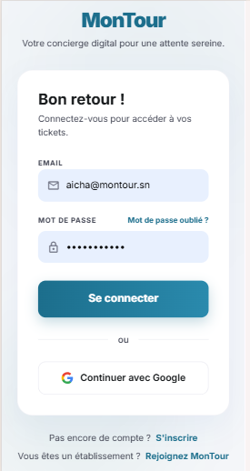
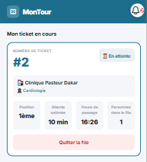
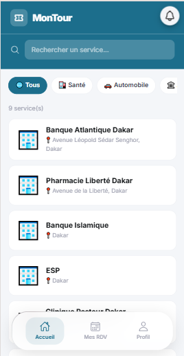
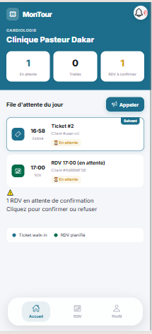
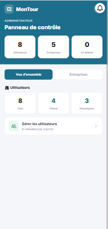

<!-- # 🎫 MonTour — Frontend

> Application mobile et web de gestion de file d'attente virtuelle et de réservation de rendez-vous au Sénégal.


---

## 📱 Aperçu

MonTour permet aux clients de prendre des tickets virtuels et de réserver des rendez-vous auprès de prestataires de services (cliniques, garages, mairies, etc.), sans faire la queue physiquement.

### Rôles disponibles
| Rôle | Description |
|------|-------------|
| **Client** | Recherche des services, prend des tickets, réserve des RDV |
| **Prestataire** | Gère sa file d'attente, ses créneaux et ses rendez-vous |
| **Administrateur** | Gère les utilisateurs et valide les entreprises |

---

## 🚀 Technologies utilisées

- **Ionic 7** + **Angular 17** (standalone components)
- **TypeScript**
- **TailwindCSS** + SCSS
- **Firebase** (Auth + Firestore) via backend API

---

## ⚙️ Prérequis

Avant de commencer, assurez-vous d'avoir installé :

- [Node.js](https://nodejs.org/) v18 ou supérieur
- [npm](https://www.npmjs.com/) v9 ou supérieur
- [Ionic CLI](https://ionicframework.com/docs/cli)

```bash
npm install -g @ionic/cli
```

---

## 📥 Installation

### 1. Cloner le projet

```bash
git clone https://github.com/DieSylla/montour-frontend.git
cd montour-frontend
```

### 2. Installer les dépendances

```bash
npm install
```

### 3. Configurer l'URL du backend

Ouvrez le fichier `src/app/services/api.ts` et modifiez l'URL de base :

```typescript
// Développement local
private baseUrl = 'http://localhost:3000/api';

// Ou backend déployé
private baseUrl = 'https://votre-backend.onrender.com/api';
```

---

## ▶️ Lancer l'application

### Mode développement (navigateur)

```bash
ionic serve
```

L'application sera disponible sur **http://localhost:8100**

### Mode mobile (Android)

```bash
ionic capacitor add android
ionic capacitor run android
```

### Mode mobile (iOS)

```bash
ionic capacitor add ios
ionic capacitor run ios
```

---

## 🧪 Comptes de test

> ⚠️ Assurez-vous que le backend est bien démarré avant de tester.

### Administrateur
| Champ | Valeur |
|-------|--------|
| Email | `admin@montour.sn` |
| Mot de passe | `admin123` |

### Prestataire
| Champ | Valeur |
|-------|--------|
| Email | `dr.ndiaye@montour.sn` |
| Mot de passe | `prestataire123` |

### Client
| Champ | Valeur |
|-------|--------|
| Email | `aminata@montour.sn` |
| Mot de passe | `client123` |

---

## 📂 Structure du projet

```
src/
├── app/
│   ├── components/          # Composants réutilisables
│   │   ├── sidebar/         # Navigation latérale desktop
│   │   ├── bottom-nav/      # Navigation mobile client
│   │   └── bottom-nav-provider/  # Navigation mobile prestataire
│   ├── pages/               # Pages de l'application
│   │   ├── login/           # Connexion
│   │   ├── register/        # Inscription
│   │   ├── client-home/     # Accueil client
│   │   ├── provider-dashboard/  # Tableau de bord prestataire
│   │   ├── admin-dashboard/ # Tableau de bord admin
│   │   └── ...
│   ├── services/            # Services API et Auth
│   └── guards/              # Guards de navigation
├── theme/                   # Variables de thème Ionic
└── global.scss              # Styles globaux
```

---

## 🔧 Build production

```bash
ionic build --prod
```

Les fichiers générés se trouvent dans le dossier `www/`.

---

## 📸 Captures d'écran

| Login | Dashboard Prestataire | Dashboard Admin |
|-------|----------------------|-----------------|
| Page de connexion sécurisée | Gestion de la file d'attente | Panneau d'administration |

---

## 👨‍💻 Auteur

**DieSylla**  
Projet de fin d'études — Mémoire 2026  
📧 diesylla@esp.sn

---

## 📄 Licence

Ce projet est développé dans le cadre d'un mémoire académique. -->


# 🎫 MonTour — Frontend

> Application mobile et web de gestion de file d'attente virtuelle et de réservation de rendez-vous au Sénégal.


> ⚙️ Backend (API NestJS) → [montour-backend](https://github.com/DieSylla/montour-backend.git)

---

## 🎯 Le problème

Au Sénégal, de nombreuses structures de service cliniques, garages, administrations, salons gèrent encore l'attente et les rendez-vous manuellement. Résultat : temps d'attente imprévisible, files physiques encombrées, et aucune visibilité pour le client sur son tour réel.

## 💡 La solution

MonTour permet aux clients de prendre des tickets virtuels et de réserver des rendez-vous auprès de prestataires de services, sans faire la queue physiquement. Les prestataires disposent d'un dashboard pour valider les rendez-vous, suivre la présence des clients (vérification GPS) et gérer les absences automatiquement.


### Rôles disponibles
| Rôle | Description |
|------|-------------|
| **Client** | Recherche des services, prend des tickets, réserve des RDV |
| **Prestataire** | Gère sa file d'attente, ses créneaux et ses rendez-vous |
| **Administrateur** | Gère les utilisateurs et valide les entreprises |

---

## 🏗️ Architecture

```
┌─────────────────────┐        ┌──────────────────────┐        ┌────────────────────┐
│   Frontend (client)  │ <───>  │   Backend (API)       │ <───>  │   Firebase          │
│   Ionic 7 / Angular  │        │   NestJS               │        │   Firestore + FCM   │
│   Web + Android       │        │                        │        │                     │
└─────────────────────┘        └──────────────────────┘        └────────────────────┘
```

## 🧠 Choix techniques

- **Firebase Firestore** plutôt qu'une base relationnelle classique : synchronisation temps réel native, adaptée au suivi de file d'attente en direct sans infrastructure serveur lourde à gérer seul.
- **NestJS** pour le backend : structure modulaire proche de l'architecture Angular du frontend, ce qui a facilité la cohérence entre les deux dépôts en solo.
- **Firebase Cloud Messaging** pour les notifications : intégration native avec Firestore, évite de maintenir un service de notification séparé.
- **TailwindCSS + SCSS** pour un design cohérent et rapide à itérer sur mobile et web.

## 🚀 Statut du projet

Projet de mémoire de Master 2 (Génie Logiciel et Systèmes d'Information — ESP/UCAD), conçu et développé seul de bout en bout : cadrage, spécification, développement, tests, déploiement sur device physique (Samsung Galaxy A14).

Une refonte est prévue pour un lancement commercial ciblant les structures de service à Dakar, avec un modèle freemium.

---

## 🚀 Technologies utilisées

- **Ionic 7** + **Angular 17** (standalone components)
- **TypeScript**
- **TailwindCSS** + SCSS
- **Firebase** (Auth + Firestore) via backend API

---

## ⚙️ Prérequis

Avant de commencer, assurez-vous d'avoir installé :

- [Node.js](https://nodejs.org/) v18 ou supérieur
- [npm](https://www.npmjs.com/) v9 ou supérieur
- [Ionic CLI](https://ionicframework.com/docs/cli)

```bash
npm install -g @ionic/cli
```

---

## 📥 Installation

### 1. Cloner le projet

```bash
git clone https://github.com/DieSylla/montour-frontend.git
cd montour-frontend
```

### 2. Installer les dépendances

```bash
npm install
```

### 3. Configurer l'URL du backend

Ouvrez le fichier `src/app/services/api.ts` et modifiez l'URL de base :

```typescript
// Développement local
private baseUrl = 'http://localhost:3000/api';

// Ou backend déployé
private baseUrl = 'https://votre-backend.onrender.com/api';
```

---

## ▶️ Lancer l'application

### Mode développement (navigateur)

```bash
ionic serve
```

L'application sera disponible sur **http://localhost:8100**

### Mode mobile (Android)

```bash
ionic capacitor add android
ionic capacitor run android
```

---

<!-- ## 🧪 Comptes de test

> ⚠️ Assurez-vous que le backend est bien démarré avant de tester.
> ⚠️ À retirer ou déplacer dans un `.env` non commité avant tout usage en production.

### Administrateur
| Champ | Valeur |
|-------|--------|
| Email | `admin@montour.sn` |
| Mot de passe | `admin123` |

### Prestataire
| Champ | Valeur |
|-------|--------|
| Email | `dr.ndiaye@montour.sn` |
| Mot de passe | `prestataire123` |

### Client
| Champ | Valeur |
|-------|--------|
| Email | `aminata@montour.sn` |
| Mot de passe | `client123` |

--- -->

## 📂 Structure du projet

```
src/
├── app/
│   ├── components/          # Composants réutilisables
│   │   ├── sidebar/         # Navigation latérale desktop
│   │   ├── bottom-nav/      # Navigation mobile client
│   │   └── bottom-nav-provider/  # Navigation mobile prestataire
│   ├── pages/               # Pages de l'application
│   │   ├── login/           # Connexion
│   │   ├── register/        # Inscription
│   │   ├── client-home/     # Accueil client
│   │   ├── provider-dashboard/  # Tableau de bord prestataire
│   │   ├── admin-dashboard/ # Tableau de bord admin
│   │   └── ...
│   ├── services/            # Services API et Auth
│   └── guards/              # Guards de navigation
├── theme/                   # Variables de thème Ionic
└── global.scss              # Styles globaux
```

---

## 🔧 Build production

```bash
ionic build --prod
```

Les fichiers générés se trouvent dans le dossier `www/`.

---

## 📸 Captures d'écran

| Login | Ticket virtuel | Dashboard Client |
|-------|----------------|-------------------|
|  |  |  |

| Dashboard Prestataire | Dashboard Admin |
|------------------------|------------------|
|  |  |

---

## 👨‍💻 Auteur

**DieSylla**  
Projet de fin d'études — Mémoire 2026  
📧 diesylla@esp.sn

---

## 📄 Licence

Ce projet est développé dans le cadre d'un mémoire académique.